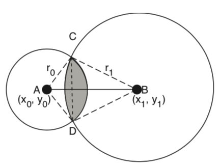
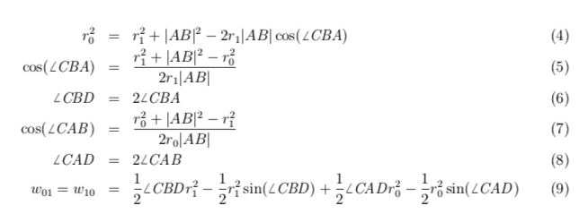
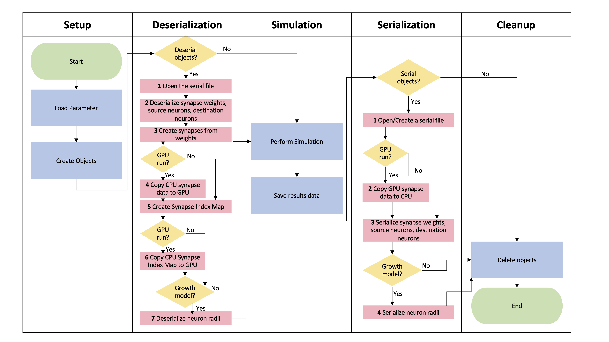

# 5. Implementation

## 5.1 the Growth Model

The **cortical culture growth model** is a feature model in BrainGrid which enables simulations of the growth of a network in dissociated cortical cell cultures. This model simulates 10,000 neurons growing 28 days <em>in vitro (DIV)</em>. It includes dynamical neuron (an integrate-and-fire type) and synapse models and an activity-dependent neurite outgrowth model to capture network characteristics.

In the neurite outgrowth model, each neuron has a region of connectivity, simulating the neurite density. This region of connectivity is modeled as a circle with a radius that changes dynamically based on the neuron’s spiking rate. The model describes that low firing rates stimulate neurite outgrowth, and high firing rates cause regression.

When the regions of two neurons overlap, these two neurons are defined as connected. This causes the formation of the synapse. The overlapping region then becomes the synaptic weight, or synaptic strength. However, when two neurons do not overlap, no connection is defined between these neurons, and thus no synapse formed.

## 5.2 Serialization and Deserialization

Serialization and deserialization is a process for preserving objects in programming. It is used when an object needs to be stored or transmitted temporarily for later usage. In BrainGrid, we implemented serialization and deserialization to store internal network states so that simulations can be continued. 

Currently, BrainGrid enables serialization and deserialization of **synapse weights, synapse source neurons, synapse destination neurons, and neuron radii**. [Cereal](https://uscilab.github.io/cereal/index.html) is utilized for serialization and deserialization implementation. Since these four objects are dynamic arrays and Cereal doesn't support dynamic array serializaiton, a helper data structure, <em>Vector</em>, was used for implementation. In serialization, vectors were created first, and values in dynamic arrays were copied over. As a result, the objects were serialized as a vector data type. On the other hand, in deserialization, vectors were created first. The data in the serialization file was copied over. Finally, values in vectors were copied back to dynamic arrays.

The figure below presents the workflow of serialization and deserialization in BrainGrid.

As seen in this figure, both serialization and deserialization are optional to users when conducting a simulation. In addition, in step 2 during serialization and step 4 during deserialization, a <em>copyGPUSynapseToCPU()</em> function and a <em>copyCPUSynapseToGPU()</em> function were implemented and called for GPU-based simulation. This was because in GPU-based simulations, some computations are conducted on the GPU and the data is also on the GPU. Thus, the data is copied to the CPU for serialization and to the GPU for deserialization. Lastly, in step 3 during deserialization, a <em>createSynapsesFromWeights()</em> function was implemented and called to re-create synapses. This was because those three serialized synapse objects only represent some of the synapse properties, other synapse properties need to be re-constructed as well. The createSynapsesFromWeights() function iterates each element in the deserialized synaptic weight array to re-create each synapse so that simulation can continue from this point.

---------
[<< Go back to BrainGrid Home page](http://uwb-biocomputing.github.io/BrainGrid/)