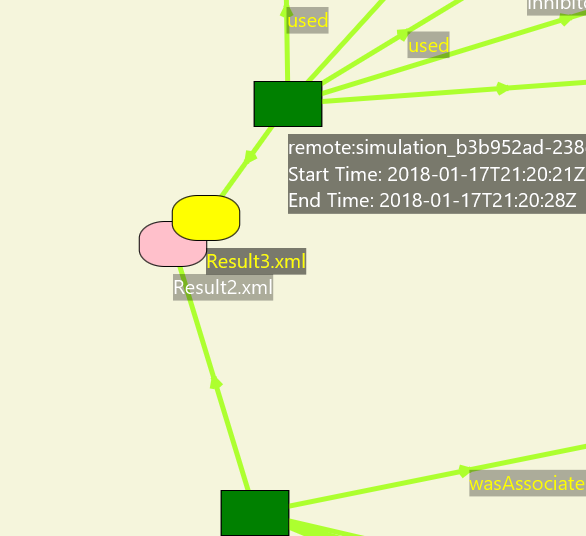
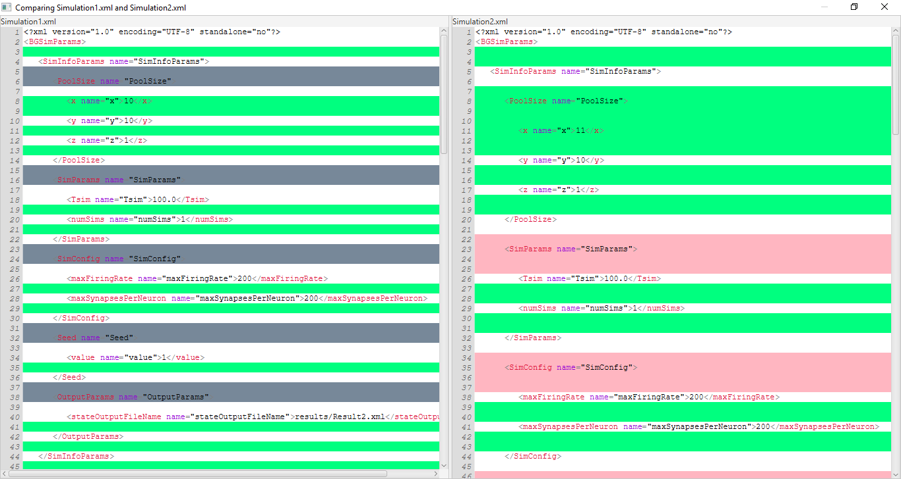

## 3. Workbench Dashboard
The purpose of Workbench Dashboard is to employ interactive visualization to help Workbench users identify and understand the relationships among simulation artifacts easily, and potentially help the analysis of simulation results.

### 3.1. Running Workbench Dashboard
Currently, Workbench Dashboard is separated from the Workbench. That means it could not been invoked through Workbench. More work will be done to integrate Workbench Dashboard into the Workbench.

Before the integration, developers could run Workbench Dashboard using Maven or Java IDEs.

#### 3.1.1. Maven
1. Set the main class in the project file **pom.xml** to **edu.uwb.braingrid.workbench.provvisualizer.ProvenanceVisualizer**.

2. Compile and build the project using the following command.
```shell
mvn clean install
```

#### 3.1.2. Java IDEs
1. Run the main class **edu.uwb.braingrid.workbench.provvisualizer.ProvenanceVisualizer** directly.

### 3.2. Visualizations and interactions
#### 3.2.1. Visualizations
1. The initail UI looks like this. Click the "Choose File" button to visualize a provenance file generated by Workbench.


2. The provenance file should be a Turtle File (.ttl) with [PROV-O standard](https://www.w3.org/TR/2013/REC-prov-o-20130430/).


3. The visualization may looks similar to the screen dump below. It is a node-link diagram. To check the meanings of the nodes, display the legend by using the "Legend" toggle button at the right side.


#### 3.2.2. Show a legend
1. The Legend explains the meaning of each node.


#### 3.2.3. Show labels
1. Move a mouse on a node or a edge to display the label of the node or edge. Click on the node or edge to keep showing the label when the mouse is not on the node or edge.


#### 3.2.4. Move nodes around
1. Use the "Stop Vertices" toggle button to disenble automatic node distribution. Then, users can move nodes freely.


#### 3.2.5. Highlighting an activity node and its related nodes
1. If a mouse is on an activity node, the activity node and its related nodes is enlarged. Also, the edge color change to green. It is used to highlight significant information related to the activity.


#### 3.2.6. Comparing two artifacts
1. Drag one node to another node until the other node change to yellow.


2. After releasing the left mouse button, a side-by-side text view window is displayed. Green lines indicate changed lines. Red lines indicate added lines. Grey lines indicate deleted lines.


### 3.3. Technologies and third party libraries
The following technologies and libraries were used to build Workbenach Dashboard.
* [Java 8](https://docs.oracle.com/javase/8/docs/)
* [JavaFX](https://docs.oracle.com/javase/8/javafx/get-started-tutorial/jfx-overview.htm#JFXST784)
* [JGit](https://www.eclipse.org/jgit/documentation/)
* [RichTextFX](https://github.com/FXMisc/RichTextFX)
* [ControlsFX](http://fxexperience.com/controlsfx/)
* [DiffUtils](https://code.google.com/archive/p/java-diff-utils/)
